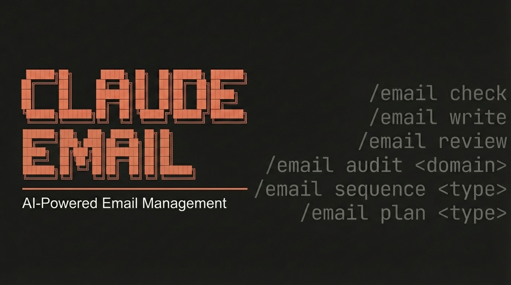

<p align="center">
  
</p>

# Claude Email — AI-Powered Email Management and Marketing

> Professional email management, deliverability optimization, and marketing strategy powered by Claude Code

**6 sub-skills** | **4 agents** | **3 scripts** | **MIT License**

---

## Features

- **Inbox Triage**: AI importance scoring, smart labeling, and contextual reply suggestions via Gmail/Outlook MCP
- **Email Composition**: Proven copywriting frameworks (PAS, AIDA, BAB, FAB, 4Ps) with tone/voice matching
- **Pre-Send Review**: 0-100 quality scoring across clarity, professionalism, CTA strength, tone, and technical quality
- **Deliverability Audit**: SPF/DKIM/DMARC validation, blacklist monitoring, bulk sender compliance (Google/Yahoo/Microsoft 2024-2026)
- **Automation Sequences**: Welcome series, nurture flows, re-engagement, abandoned cart, post-purchase drips
- **Marketing Strategy**: Industry-specific templates with 90-day roadmap, KPI targets, and content calendars
- **User Profiles**: Adaptive system learns your business type, platform, brand voice, and preferences

---

## Quick Start

```bash
curl -fsSL https://raw.githubusercontent.com/AgriciDaniel/claude-email/main/install.sh | bash
```

After installation, run `/email` in Claude Code to start the interactive wizard.

---

## Commands

| Command | Description |
|---------|-------------|
| `/email` | Interactive mode with skill selection menu |
| `/email check` | Inbox triage with importance scoring and reply suggestions |
| `/email write` | Compose email using copywriting frameworks |
| `/email review` | Quality review with 0-100 scoring and improvement suggestions |
| `/email audit <domain>` | Deliverability audit (SPF/DKIM/DMARC, blacklists, compliance) |
| `/email sequence <type>` | Design automation sequence (welcome, nurture, cart, etc.) |
| `/email plan <business>` | Marketing strategy with 90-day roadmap |

---

## MCP Integration

Claude Email integrates with email platforms via MCP servers:

### Required (for inbox features)
- **Gmail**: [taylorwilsdon/google_workspace_mcp](https://github.com/taylorwilsdon/google_workspace_mcp)
- **Microsoft 365**: [Softeria/ms-365-mcp-server](https://github.com/Softeria/ms-365-mcp-server)

### Optional (for advanced features)
- **SendGrid**: [Garoth/sendgrid-mcp](https://github.com/Garoth/sendgrid-mcp) - Transactional email analytics
- **Mailchimp**: Campaign management and automation
- **Kit.com** (ConvertKit): Creator-focused email marketing

At least one inbox MCP (Gmail or Outlook) is required for `/email check`. All other features work standalone.

---

## Architecture

```
claude-email/
├── email/SKILL.md                    # Main orchestrator
├── skills/
│   ├── email-check/SKILL.md         # Inbox triage
│   ├── email-write/SKILL.md         # Composition
│   ├── email-review/SKILL.md        # Quality review
│   ├── email-audit/SKILL.md         # Deliverability
│   ├── email-sequence/SKILL.md      # Automation design
│   └── email-plan/SKILL.md          # Marketing strategy
├── agents/
│   ├── email-deliverability.md      # Technical validation
│   ├── email-compliance.md          # Legal/regulatory checks
│   ├── email-content.md             # Copywriting analysis
│   └── email-inbox.md               # Triage logic
├── scripts/
│   ├── check_deliverability.py      # SPF/DKIM/DMARC validation
│   ├── analyze_email_html.py        # HTML quality scoring
│   └── score_subject_line.py        # Subject line analysis
├── email/references/
│   ├── deliverability-rules.md      # DNS, authentication, reputation
│   ├── benchmarks.md                # Industry metrics
│   ├── compliance.md                # CAN-SPAM, GDPR, CASL
│   ├── copy-frameworks.md           # PAS, AIDA, BAB, FAB, 4Ps
│   ├── technical-standards.md       # HTML, rendering, accessibility
│   └── mcp-integration.md           # Platform-specific guides
├── skills/email-plan/assets/
│   ├── local-business.md            # Local/service business strategy
│   ├── saas.md                      # SaaS strategy
│   ├── ecommerce.md                 # E-commerce strategy
│   ├── creator.md                   # Creator/influencer strategy
│   ├── agency.md                    # Agency/B2B strategy
│   └── generic.md                   # General business strategy
└── hooks/
    ├── pre-send-check.sh            # Pre-send validation hook
    └── validate-email-html.py       # HTML quality gate
```

---

## Requirements

- **Claude Code CLI** (latest version)
- **Python 3.10+** (for deliverability scripts)
- **Gmail MCP** or **Outlook MCP** (for inbox triage features)
- **Optional**: `checkdmarc` Python package for advanced DNS validation

---

## Installation

### Unix/macOS (bash)
```bash
curl -fsSL https://raw.githubusercontent.com/AgriciDaniel/claude-email/main/install.sh | bash
```

### Windows (PowerShell)
```powershell
irm https://raw.githubusercontent.com/AgriciDaniel/claude-email/main/install.ps1 | iex
```

### Manual Installation
```bash
git clone https://github.com/AgriciDaniel/claude-email.git
cd claude-email
chmod +x install.sh
./install.sh
```

---

## Uninstall

```bash
curl -fsSL https://raw.githubusercontent.com/AgriciDaniel/claude-email/main/uninstall.sh | bash
```

---

## Examples

### Inbox Triage
```
/email check

# Returns:
# - Importance scores (0-100) for each email
# - Smart labels (urgent, actionable, informational, promotional)
# - Contextual reply suggestions for top 5 emails
```

### Compose Marketing Email
```
/email write

# Interactive prompts:
# - Email purpose (newsletter, promotion, announcement)
# - Target audience
# - Key message/offer
# - CTA goal
# - Tone/voice
#
# Generates email using appropriate framework (PAS, AIDA, etc.)
```

### Pre-Send Review
```
/email review

# Paste email content, receive:
# - Overall score (0-100)
# - Category scores: clarity, professionalism, CTA, tone, technical
# - Specific improvement suggestions
# - Subject line A/B test variants
```

### Deliverability Audit
```
/email audit yourdomain.com

# Checks:
# - SPF/DKIM/DMARC DNS records
# - Blacklist status (20+ databases)
# - Google/Yahoo bulk sender compliance
# - HTML rendering quality
# - Spam score prediction
```

### Design Automation Sequence
```
/email sequence welcome

# Generates:
# - 5-7 email sequence with timing recommendations
# - Subject lines and preview text
# - Full email copy for each message
# - Branching logic based on engagement
# - Success metrics and optimization tips
```

### Marketing Strategy
```
/email plan saas

# Delivers:
# - 90-day roadmap with campaigns
# - Segmentation strategy
# - Content calendar
# - KPI targets and benchmarks
# - Platform/tool recommendations
```

---

## User Profile System

On first run, `/email` generates an `email-profile.md` file in your project root with:

- **Business type**: local business, SaaS, e-commerce, creator, agency, personal
- **Primary email platform**: Gmail, Outlook, other
- **Compliance regions**: US only, EU/GDPR, both
- **Brand voice**: professional, friendly, casual, authoritative

All sub-skills reference this profile to adapt recommendations. Delete `email-profile.md` to re-run onboarding.

---

## License

MIT License - see [LICENSE](LICENSE) for details.

---

## Support

For support, please use [GitHub Issues](https://github.com/AgriciDaniel/claude-email/issues) or [Discussions](https://github.com/AgriciDaniel/claude-email/discussions).

---

## Changelog

See [CHANGELOG.md](CHANGELOG.md) for version history and updates.

---

## Related Skills

- **[claude-seo](https://github.com/AgriciDaniel/claude-seo)**: SEO content optimization and strategy
- **[claude-ads](https://github.com/AgriciDaniel/claude-ads)**: Paid advertising campaign management
- **claude-skool**: Community and course management (coming soon)

---

**Powered by Claude Code** | **[Agent Skills Open Standard](https://agentskills.io)**
